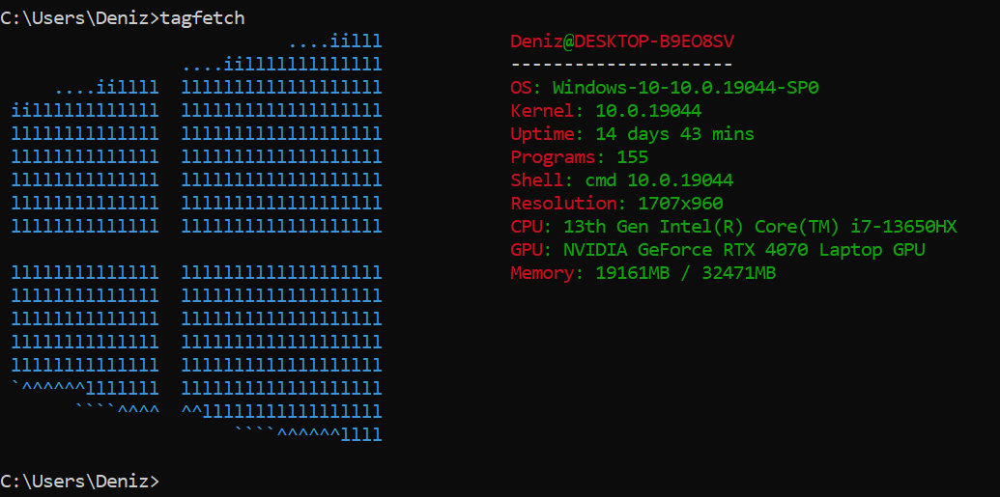
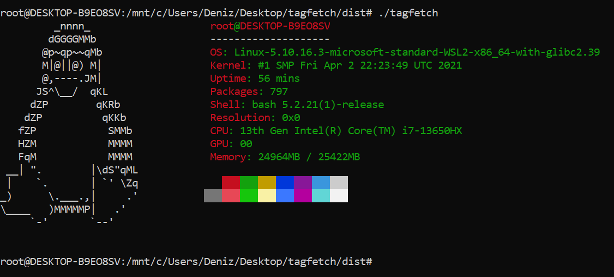
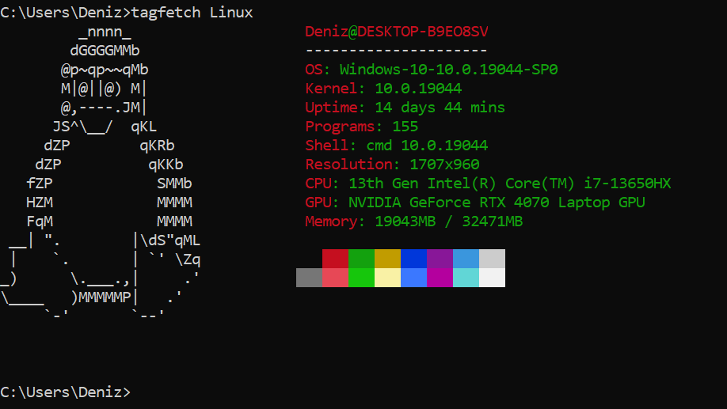
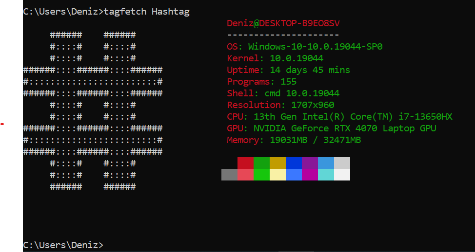

  <h1>TagFetch</h1>
  <h3>Simple Python written system fetcher</h3>

  
  

  <h2>How to use: </h2>

  <pre style="background: #1e1e2e; color: #cdd6f4; padding: 20px 24px; border-radius: 12px; font-family: 'Courier New', monospace; font-size: 14px; line-height: 1.8; text-align: left; display: inline-block; border: 1px solid #313244;">
<pre style="background: #0d1117; color: #e6edf3; padding: 24px; border-radius: 12px; font-family: 'Courier New', monospace; font-size: 14px; line-height: 2; border: 1px solid #30363d; text-align: left; max-width: 600px; margin: 0 auto;">
<code>
# Show system info with default theme
$ tagfetch

# Show system info with Linux theme
$ tagfetch Linux

# Show system info with Hashtag theme
$ tagfetch Hashtag

# Show system info with Windows theme
$ tagfetch Windows

# Show system info with macOS theme
$ tagfetch Darwin
</code>
</pre>
  </pre>

  <h2>How to build: </h2>
  <pre><code>pyinstaller TagFetch.spec</code></pre>
  <h2>Screenshots: </h2>
  

    
    
    
    
  

   
  <h2>How to install: </h3>
  <h3>Linux: </h3>
  
curl https://raw.githubusercontent.com/elitrycraft/tagfetch/r
efs/heads/main/get.sh | bash

